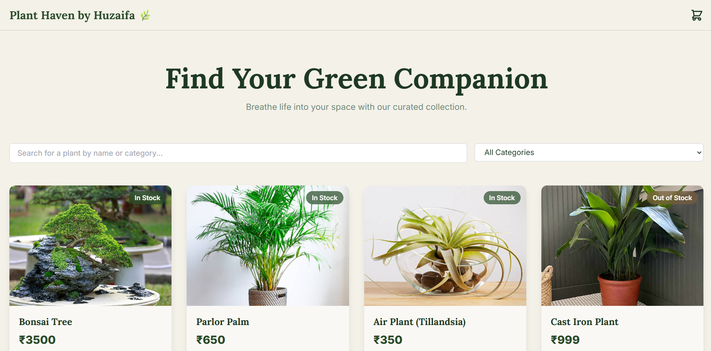
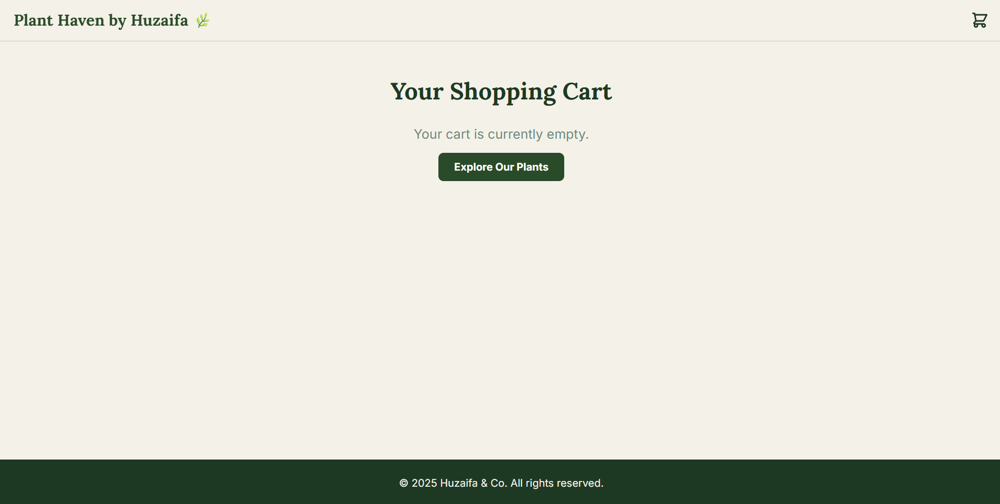
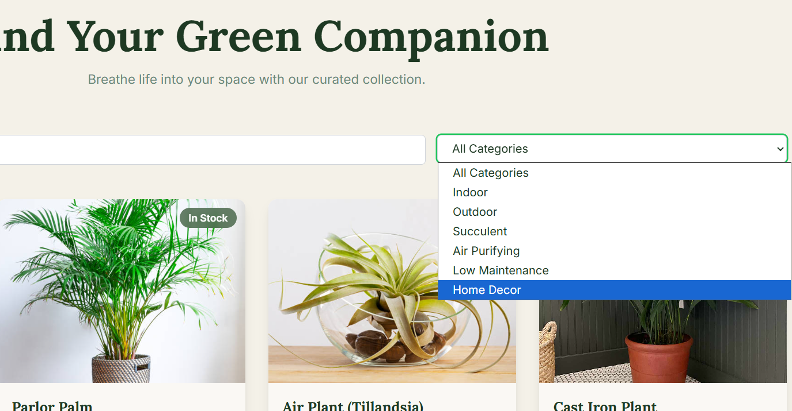
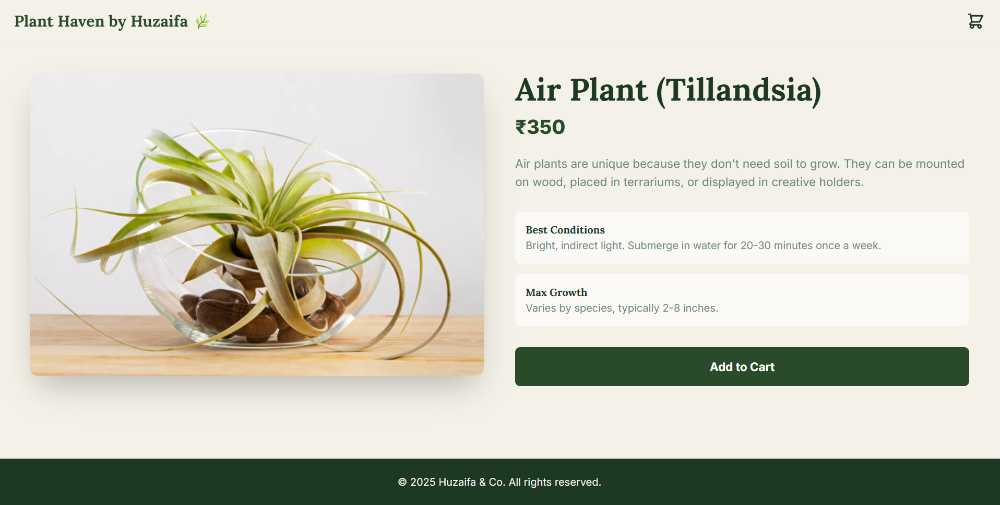

# Verdant & Co. by Huzaifa 🌿

A modern, full-stack e-commerce application for a boutique plant store. This project features a clean, aesthetic frontend built with Next.js and a robust backend API powered by Node.js, Express, and MongoDB.

**Live Demo:** [**https://mini-plant-store-rho.vercel.app**](https://mini-plant-store-rho.vercel.app) 

---

## 📸 Screenshots & Demo

| Homepage | Cart |
|---------------|--------------------|
|  |  |

| Category | Plant Information |
|------------|-------------|
|  |  |

---

---
## ## Features

-   **Responsive & Aesthetic UI:** A beautiful, mobile-first design that provides a seamless user experience on any device.
-   **Plant Catalog:** Browse a detailed collection of plants fetched from the backend API.
-   **Dynamic Search & Filtering:**
    -   **Search:** Instantly find plants by name with a case-insensitive search.
    -   **Filter:** Easily filter the catalog by categories like "Indoor," "Air Purifying," etc.
-   **Plant Detail Pages:** Click on any plant to view a dedicated page with more information, including care instructions and descriptions.
-   **Shopping Cart:** A fully functional cart page with global state management via React Context. Users can add, remove, and update the quantity of items.
-   **Admin Functionality:** A secure route and form to add new plants to the database.

---
## ## Tech Stack

This project is a full-stack application built with the MERN stack and modern deployment practices.

| Category           | Technology                                                                                                  |
| :----------------- | :---------------------------------------------------------------------------------------------------------- |
| **Frontend** | **Next.js**, **React**, **Tailwind CSS** |
| **Backend** | **Node.js**, **Express.js** |
| **Database** | **MongoDB** (with Mongoose)                                                                                 |
| **Deployment** | **Vercel** (Frontend), **Render** (Backend), **MongoDB Atlas** (Database)                                     |
| **State Management** | **React Context API** |

---
## ## Local Setup & Installation

To run this project locally, you will need to set up both the backend and the frontend from the root directory.

### ### Backend (`plant-store-api`)

1.  **Navigate to the backend directory:**
    ```bash
    cd plant-store-api
    ```
2.  **Install dependencies:**
    ```bash
    npm install
    ```
3.  **Create a `.env` file** in the `plant-store-api` root and add the following variables:
    ```
    MONGO_URI=your_mongodb_connection_string
    ADMIN_API_KEY=your_secret_admin_key
    ```
4.  **(Optional) Seed the database:** To populate the database with the sample plant data, run the seed script once.
    ```bash
    node seed.js
    ```
5.  **Start the server:**
    ```bash
    npm run dev
    ```
    The API will be running at `http://localhost:5001`.

### ### Frontend (`plant-store-ui`)

1.  **Navigate to the frontend directory from the root:**
    ```bash
    cd plant-store-ui
    ```
2.  **Install dependencies:**
    ```bash
    npm install
    # or if you use yarn
    # yarn install
    ```
3.  **Create a `.env.local` file** in the `plant-store-ui` root and add the following variables:
    ```
    NEXT_PUBLIC_API_URL=http://localhost:5001
    NEXT_PUBLIC_ADMIN_API_KEY=your_secret_admin_key
    ```
4.  **Start the development server:**
    ```bash
    npm run dev
    # or
    # yarn dev
    ```
    The application will be available at `http://localhost:3000`.

---
## ## API Endpoints

The backend server provides the following RESTful API endpoints:

| Method | Endpoint              | Description                                        |
| :----- | :-------------------- | :------------------------------------------------- |
| `GET`  | `/api/plants`         | Fetches all plants with optional search & filtering. |
| `GET`  | `/api/plants/:id`     | Fetches a single plant by its unique ID.           |
| `POST` | `/api/plants`         | Adds a new plant to the database (Admin protected).  |

**Query Parameters for `GET /api/plants`:**
-   `search=<keyword>`: Filters plants by name or category.
-   `category=<category_name>`: Filters plants by a specific category.

## 📬 Contact
- **Email:** ahmadhuzaifa1097@gmail.com 
- **Portfolio:** [huzaifa-portfolio-seven.vercel.app](https://huzaifa-portfolio-seven.vercel.app)  
- **LinkedIn:** [Abu Huzaifa Ahmad](https://www.linkedin.com/in/abu-huzaifa-ahmad-68175222a)
